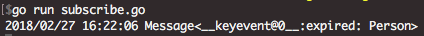

# how to use

1. use redis_sub.go to listen.
2. run redis_setValue.go, check expire time.
3. when timeup, [listen client] will get notify.

# subscribe & expire

0. run redis server first
1. `go run subscribe.go`, start listen 'expired' task 
2. `go run set.go`, set a key and expire 10s

