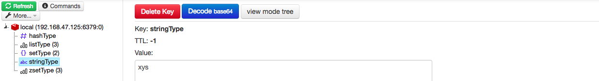
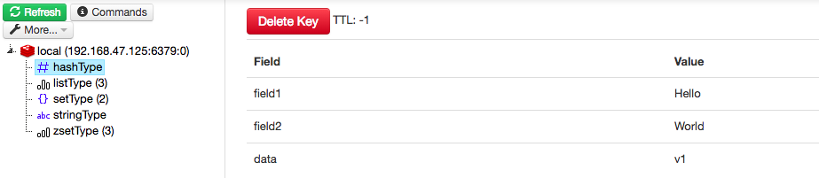
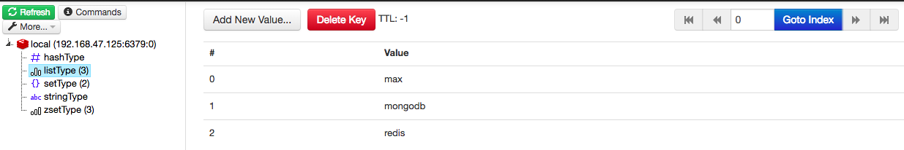
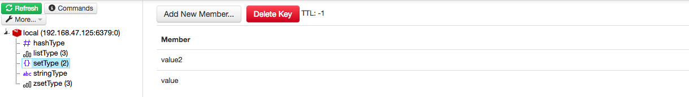
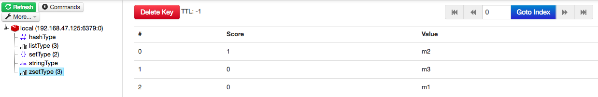

# use

> image : https://hub.docker.com/_/redis/

1. 填入 docker-compose.yml 中的 ip 位置
    - 如果是要接收本地端 docker-redis，請用 `links: redis` 進行設定，如目前 docker-compose.yml 設定
    - 如果要接收外部的 redis，請設定 ip。注意 : 
        1. redis-server，conf 裏的 `protected-mode no`. 
            - 啟動服務器 : `redis-server --protected-mode no`
            - 或者在 redis conf 中進行更改
        2. docker-compose.yml 中的 'redis' 改為 ip
2. `docker-compose up -d` 
3. browser : `localhost:8081`

> 設定 redis-server 過期 key 通知 : http://blog.csdn.net/Aeroleo/article/details/77011839
> 指令 : `redis-server --notify-keyspace-events Ex`

# type in admin

## string type

## hash type

## list type

## set type

## zset type

# 過期事件監聽

1. redis.conf 的 'notify-keyspace-events' 設定為 'Ex'
    - 或者啟動 redis-server 時 ex : `redis-server --notify-keyspace-events Ex`
2. client_1, listen : `redis-cli subscribe __keyevent@0__:expired`
3. client_2, 
    - `redis-cli set {key} {value}`
    - `redis-cli expire {key} {second}` 
5. client_1 will get expired event